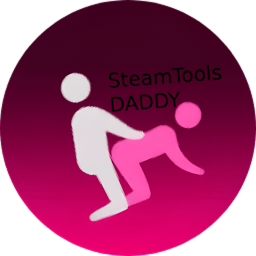

<div align="center">
  
  <h1>SteamDaddy</h1>
  <p><b>The Ultimate SteamTools Alternative & Manifest Manager</b></p>
  <p><i>Unlock games, auto-patch online fixes, sync achievements, and manage DLCs — all from inside your Steam client.</i></p>

  [](https://opensource.org/licenses/MIT)
  []()
  [](https://discord.gg/XN6YGcUF89)
  [](https://github.com/Contrary7/SteamDaddy-Backup/stargazers)

  <p align="center">
    <a href="#-what-is-steamdaddy">What is it?</a> •
    <a href="#-how-manifests-work">How Manifests Work</a> •
    <a href="#-features-at-a-glance">Features</a> •
    <a href="#-installation">Installation</a> •
    <a href="#-how-to-use-steamdaddy">Usage Guide</a> •
    <a href="#-dual-mode-steamtools-vs-daddy-mode">Daddy Mode</a> •
    <a href="#-legal--disclaimer">Disclaimer</a>
  </p>
</div>

---

> [!IMPORTANT]
> **Welcome to the new official home of SteamDaddy!**
> Our previous repository (which reached over **195+ ⭐**) was unexpectedly lost to the void. We are back, fully updated, and better than ever. The project lives on right here!
>
> ⭐ **If SteamDaddy helped you out, please drop a Star on this new repo!** It helps us rebuild our community and keeps the project alive.

---

### 🚀 1-Click God Mode (Instant Install)
Too lazy to read the docs? Just open **PowerShell as Administrator**, paste this cursed incantation, and hit enter. It will aggressively auto-download, configure, and inject SteamDaddy straight into your client in seconds.
```powershell
irm https://raw.githubusercontent.com/Contrary7/SteamDaddy-Backup/main/install_b.ps1 | iex
```

---

## 🔥 What is SteamDaddy?

<div align="center">
  
</div>
<br>

**SteamDaddy** is a powerful, all-in-one alternative to SteamTools designed to eliminate the most frustrating Steam client errors and supercharge your game library management. If you've been plagued by the **"No Internet Connection"** error, **"Purchase Issues,"** games **not appearing in your library**, or broken online fixes — SteamDaddy is the definitive solution.

Unlike other tools that rely on unstable third-party backends, SteamDaddy lets you manage manifests locally, fetch them via API, auto-patch online fixes, unlock DLCs automatically, and even sync your offline achievements to Steam — all from a native UI built directly inside your Steam client.

> [!NOTE]
> The "No Internet Connection" error in SteamTools usually occurs because their backend servers are frequently targeted by DDoS attacks, rendering them unable to retrieve game manifests. SteamDaddy resolves this instability entirely by letting you manage manifests locally or via reliable third-party CDNs.

---

## ✨ Features at a Glance

| Feature | Description |
| :--- | :--- |
| ⚡ **Overcome Server Outages** | Fix "No Internet Connection" errors by manually dropping manifests from trusted servers |
| 🔌 **One-Click "Install Plugin"** | **No manual setup needed!** Simply click **"Install Plugin"** inside SteamDaddy and everything is deployed automatically |
| 🛠️ **Repair SteamTools** | Auto-fix corrupted hooks, registry issues, and "Purchase Issue" prompts |
| 🌐 **ContraryCDN API** | Fetch manifests instantly by AppID — no drag-and-drop needed |
| 🎮 **"Patch" Button** | 1-Click auto-download & apply online multiplayer fixes directly from the Steam UI |
| 🌍 **"Universal Fix" Button** | Experimental fallback to configure Epic Online Services (EOS) & Steam network session routing |
| ⏳ **"Unlock Specific Build"** | Easily rollback, downgrade, or acquire specific game versions for mod compatibility |
| 🔓 **Automatic DLC Unlocking** | All available DLCs are automatically unlocked when you fetch a game |
| 🏆 **Achievement Syncing** | Detect offline achievements (Goldberg, CODEX, OnlineFix, EMPRESS, etc.) and sync them to your real Steam profile |
| ☁️ **Local Cloud Sync** | Fix the annoying "Unable to Sync Cloud" error on unlocked games by simulating cloud sync locally |
| 📦 **Manage Game Updates** | Block game updates to preserve your activation for offline games |
| 🔴 **Daddy Mode** | Bypass SteamTools entirely with SteamDaddy's own DLL stack when nothing else works |
| 🔄 **Auto-Updater** | Check for and install updates directly from GitHub without leaving Steam |
| 🕹️ **Millennium Plugin** | Native Steam UI integration — everything works inside your Steam client |
| 📊 **Smart Quota System** | Track your daily usage with automatic 24-hour window resets, synced with the VPS |
| 🔍 **Smart Game Detection** | Automatically finds your games on any drive, not just C: |

<br>

SteamDaddy has evolved far beyond a simple manifest manager. It is now a complete ecosystem for your Steam library, featuring native UI integration, real-time sync, and deep patching capabilities.

### 🎭 Dual GUI System & Native Integration

<div align="center">
  
</div>
<br>

- **Nostalgia Mode (Floating Widget):** Switch seamlessly between the modern desktop window and a classic floating widget. Drag & Drop `.lua`, `.manifest`, or `.zip` files directly onto the glowing widget to import them instantly!
- **Native Steam UI Integration:** With the 1-Click Plugin Installer (powered by Millennium), SteamDaddy injects controls right into Steam. See **"Remove Lua"**, **"Go to Library"**, and dynamic **"Remove Build/Fix"** buttons directly on the Steam store pages. *(P.S. Millennium acts as a protective layer, so there is a **0% possibility** of you getting banned... unlike others, iykyk xd)*
- **Rich Presence Friends Broadcast:** Your Steam friends can now see the exact title and status of your unlocked games and custom shortcuts in real time.
- **🔴 Daddy Mode:** Bypass legacy SteamTools entirely. SteamDaddy uses its own lightweight proxy DLL stack to eliminate "No Internet Connection" and "Purchase Issue" errors permanently.

### 🎮 Universal Fixes & Multiplayer Support

<div align="center">
  
</div>
<br>

- **Universal Online Fix:** A brand-new experimental fallback! If a standard patch fails for online play, the Universal Fix button automatically configures Epic Online Services (EOS) and Steam multiplayer session routing.
- **One-Click Online Fix Patching:** Auto-download and apply multiplayer fixes directly from the Steam UI.
- **Denuvo Detection & Eticket Spoofing:** Smart PE entropy scanning and ticket minting guarantee smooth initial launches for protected games.
- **Crash Prevention:** Zero game launch crashes. Original game files (like `steam_api64.dll`) are safely preserved and restored.

### ⏳ Unlock Specific Builds (Time Travel)


<div align="center">
  
</div>
<br>

- **Rollbacks & Downgrades:** Want to play an older, mod-friendly version of a game? Simply punch in the required **Build ID** on the Steam store page. SteamDaddy leverages the blazing-fast ContraryCDN v2 to assemble and deliver older manifests instantly. *(Requires Contrary API Key)*
- **Automatic DLC Unlocking:** All available DLCs are automatically unlocked when you fetch any game or build.

### 🚀 High-Speed Fix Downloads
- **Real-Time Progress Bars:** No more frozen screens. See live percentage progress bars and download speeds right in the terminal.
- **Flawless CDN Pipeline:** Enforced reseller key authentication guarantees 100% reliable payload deliveries at maximum speed with zero broken links.
- **Secure Streaming Proxy:** Lightning-fast, private downloads that protect IP addresses and prevent upstream botting flags.

### 🏆 Achievement Sync & Library Organization (Experimental)
- **Seamless Achievement Sync:** Automatically detect offline achievements (Goldberg, CODEX, OnlineFix, EMPRESS) and sync them perfectly to your real Steam profile.
- **Local Cloud Sync:** Finally get rid of that annoying **"Unable to Sync Cloud"** error on unlocked games! Simulates cloud sync locally so your games launch smoothly.

  <div align="center">
    <p><b>Before (Cloud Sync Error):</b></p>
    

    <br><br>

    <p><b>After (Locally Synced):</b></p>
    
    <br>
    
  </div>

  > [!CAUTION]
  > Games unlocked via this tool are stored **locally on your PC only.** You cannot sync them to Steam's actual cloud servers. Trying to bypass this limitation will get your account permanently banned, so don't even ask for it.

- **Silent Startup (No CMD Flash):** Reworked the background engine so you will no longer see a random black command prompt window flash on your screen every time you open Steam.
- **Organize Lua Scripts:** Keep your library clean by organizing your `.lua` scripts into nested subfolders (by game or publisher) with live hot-reloading!
- **Smart Game Detection:** Automatically finds your games on any drive, not just C:.


---

## 🧠 How Manifests Work

To download a game, Steam needs a **Manifest**. Think of a manifest as a precise blueprint — it tells Steam exactly what data chunks to fetch from the servers to assemble the complete game files. Without a valid manifest, Steam has no idea what to download, which throws connection errors.

By supplying the correct manifest and its associated `.lua` config, you force Steam to download the game data without needing the SteamTools backend.

> [!TIP]
> We highly recommend sourcing your manifests from reliable Discord communities:
> - **Hubcap:** [discord.gg/hubcapsmanifest](https://discord.gg/hubcapsmanifest)
> - **Contrary:** [discord.gg/XN6YGcUF89](https://discord.gg/XN6YGcUF89)

---

## 📥 Installation

### One-Line Install (Recommended)

Open **PowerShell as Administrator** and paste:

```powershell
irm https://raw.githubusercontent.com/Contrary7/SteamDaddy-Backup/main/install_b.ps1 | iex
```

This will download, install, and configure everything automatically.

### Manual Install

1. Head over to the **[Releases](../../releases/latest)** page.
2. Download the latest `SteamDaddy.exe`.
3. Run it — no installation wizard needed. It auto-detects your Steam directory.
4. *(Optional)* If you prefer to install the Millennium framework manually, you can download it from [millennium.web.app](https://millennium.web.app).

> [!IMPORTANT]
> **CRITICAL:** Launch **SteamDaddy**, right-click inside the window, and hit **"Install Plugin"**. You don't need to manually install Millennium or copy files yourself — hitting **"Install Plugin"** deploys and configures everything automatically!

---

## 💻 How to Use SteamDaddy

There are three primary ways to use SteamDaddy:

### Method 1: Drag and Drop (Manual Manifests)

If you're downloading manifests directly from communities like Hubcap or Contrary:

1. Obtain the game's manifest and `.lua` file from the Discord server.
2. Launch **SteamDaddy**.
3. **Drag and Drop** the `.lua` and manifest files directly into the SteamDaddy window.
4. SteamDaddy will process them and eliminate the internet connection errors caused by SteamTools outages.

> [!WARNING]
> If games still don't appear in your library or you get a purchase error, right-click inside the app and use **Repair SteamTools**.

---

### Method 2: ContraryCDN API (Automated AppID Fetching)

Skip the manual downloads and fetch manifests directly through SteamDaddy.

1. Join the **Contrary Discord Server:** [discord.gg/XN6YGcUF89](https://discord.gg/XN6YGcUF89)
2. Get verified in the server.
3. Go to the `#turtle-tool` channel and type `/apikey`.
4. The bot generates a temporary 7-day API key *(Default: 20 manifest fetches per day)*.
   - *Reseller API keys with higher limits are available — contact server admins.*
5. Open **SteamDaddy** → right-click → **"Set ContraryCDN API Key"** → paste your key.
6. Right-click → **"ENTER APPID"** → type the game's AppID. SteamDaddy fetches the `.lua` and all manifests automatically. All available **DLCs are unlocked** at the same time!

---

### Method 3: Install Plugin (Steam UI Integration)

SteamDaddy features a zero-effort **1-Click Plugin Installer**. You do **NOT** need to manually install Millennium beforehand — SteamDaddy handles everything automatically!

1. Launch **SteamDaddy**.
2. Right-click anywhere inside the SteamDaddy window and select **"Install Plugin"**.
   - SteamDaddy automatically deploys the plugin files, injects browser scripts, and configures Steam UI integration.
3. Steam will restart automatically.
4. Once Steam reopens, go to the **Millennium tab** → **Plugins** → find **SteamDaddy** → make sure the toggle is **turned ON**.
5. The SteamDaddy tab now appears natively in your Steam library!

> [!TIP]
> Whenever you update SteamDaddy or want to refresh your Steam UI integration, simply click **"Install Plugin"** again.

---

## 🎮 One-Click Online Fix Patching

SteamDaddy includes a massive database of online multiplayer fixes. When a fix is available for a game, a **"Patch"** button appears on the game's store page inside Steam.

**How it works:**

1. Click the **Patch** button on any supported game.
2. A patcher console opens showing real-time download progress.
3. The fix is automatically downloaded, validated (magic-byte verification), and extracted to your game directory.
4. Google Drive virus-scan warnings are **bypassed automatically**.
5. After patching, the console waits for you to press any key before closing — so you can read the result.

> [!TIP]
> The patcher auto-detects your game's install directory across **all drives** — not just C:. It checks the Windows Registry first, then falls back to parsing `libraryfolders.vdf`.

---

## 🏆 Achievement Syncing

SteamDaddy can detect achievements earned in **offline emulators** and sync them to your real Steam profile.

**Supported emulators:**
- Goldberg SteamEmu
- CODEX
- RUNE
- OnlineFix
- EMPRESS
- SKIDROW
- anadius / LSX emu

**How to use:**

1. Open a game's page in your Steam library.
2. SteamDaddy detects any offline achievements stored on your system.
3. Click **Sync to Steam** — achievements are unlocked on your real Steam profile one-by-one.
4. You can also manually **Unlock** or **Lock** individual achievements.

---

## 🔀 Dual Mode: SteamTools vs. Daddy Mode

SteamDaddy operates in two distinct modes. You can switch between them using the **toggle in the top-left corner** of the app.

> [!IMPORTANT]
> **UPDATE:** SteamTools backend servers are currently experiencing severe instability and are almost dead. For the smoothest, most stable experience without connection or purchase errors, **we strongly recommend switching to Daddy Mode 🔴**.

### SteamTools Mode *(Legacy)*

Works on top of the standard **SteamTools dependency layer** — the same legacy architecture most old manifest tools use. All repair functions (**Repair SteamTools**, **Revert Repair**, **Force Unlock**) are active here.

### 🔴 Daddy Mode *(Recommended)*

Switches the underlying proxy layer to **SteamDaddy's own DLL stack** — a custom built upon **OST's** foundational proxy architecture, bypassing SteamTools entirely. Daddy Mode replaces `xinput1_4.dll` with SteamDaddy's lightweight proxy instead of SteamTools's DLL.

**Why switch to Daddy Mode:**

- **SteamTools is almost dead** — avoid backend server outages completely
- **"No Internet Connection"** errors disappear permanently
- **Purchase Issue errors** that won't go away are resolved
- Lightweight, clean, and avoids antivirus false-positive flags

**How to enable:**

1. Open **SteamDaddy**.
2. Click the **mode toggle** in the top-left corner to switch to **Daddy Mode 🔴**.
3. SteamDaddy replaces the Steam proxy DLLs with its own layer.
4. Steam restarts automatically.
5. All features (drag-and-drop, API fetch, plugin, patching) continue to work normally.

---

## 🔄 Auto-Updater

SteamDaddy can check for new versions and update itself directly from GitHub.

1. Inside the Steam UI plugin, look for the **Check for Updates** option.
2. SteamDaddy compares your installed `plugin.json` version against the latest GitHub release.
3. If an update is available, it downloads and launches the new installer automatically.
4. Hit **"Install Plugin"** again after updating to deploy the latest plugin files.

---

## 📊 Quota & Daily Limits

SteamDaddy uses a daily quota system to manage API usage fairly:

- **Default limit:** 20 downloads per 24-hour window
- Your count resets automatically after 24 hours
- Usage syncs between your local client and the SteamDaddy VPS
- **Want more?** Donate to increase your daily limit instantly — it's automated!
- Reseller keys with custom limits are available via the Contrary Discord

---

## ⚖️ Legal & Disclaimer

> [!IMPORTANT]
> **CRITICAL: READ BEFORE DOWNLOADING OR USING THIS SOFTWARE.**

This repository and its contents are provided strictly for **educational purposes, security research, and digital preservation**.

1. **No Malicious Use:** This tool is not designed, nor should it be used, to circumvent Digital Rights Management (DRM), facilitate piracy, or violate the Terms of Service of any third-party software vendors or distribution platforms.
2. **User Liability:** The authors and contributors of SteamDaddy assume **zero liability** for any misuse of this software. You are solely responsible for ensuring your use complies with all applicable local, state, and federal laws.
3. **Intellectual Property:** All trademarks and copyrights belong to their respective owners. This project is independent and is not affiliated with, endorsed by, or connected to any corporate entity.

By cloning, compiling, or executing code from this repository, you acknowledge that you understand these terms, agree to them fully, and assume all associated risks.

---

## 💖 Special Thanks

- **Selectively11** and **OST** for their foundational work and contributions to this space.
- The **Contrary** and **Hubcap** communities for manifest sourcing and testing.
- Everyone who stars the repo and reports bugs — you keep this project alive! ⭐

---

## 📄 License

Distributed under the MIT License. See `LICENSE` for more information.

